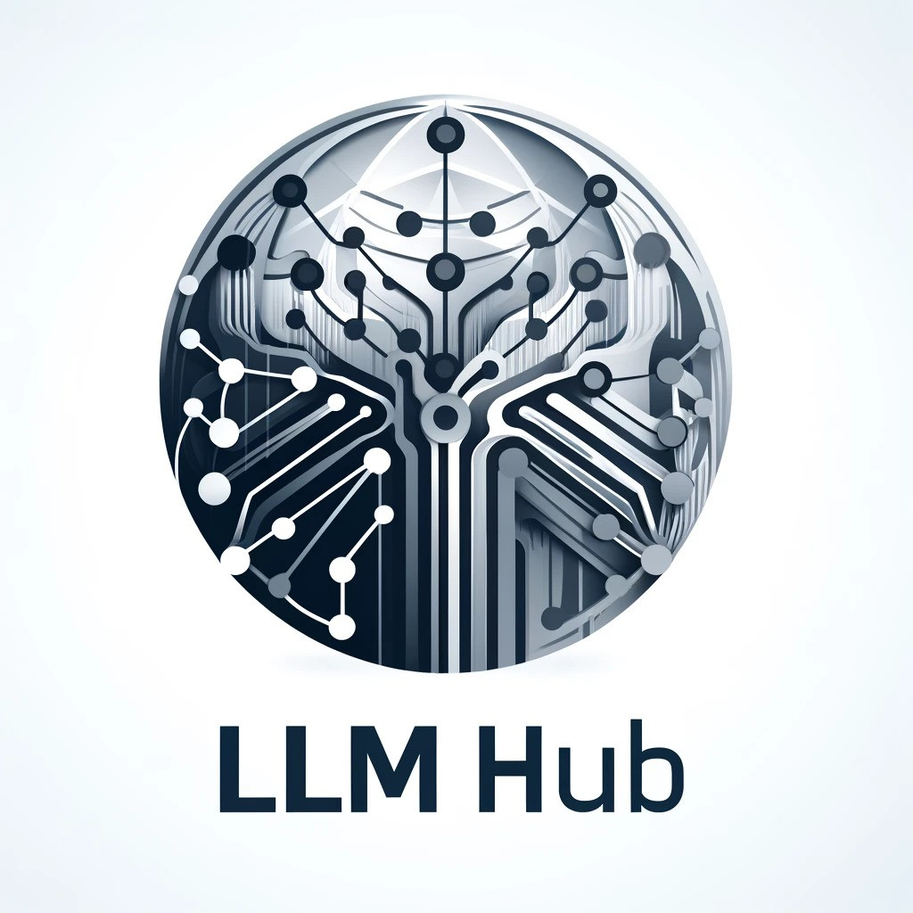

<!-- Improved compatibility of back to top link: See: https://github.com/othneildrew/Best-README-Template/pull/73 -->
<a name="readme-top"></a>
<!--
*** Thanks for checking out the Best-README-Template. If you have a suggestion
*** that would make this better, please fork the repo and create a pull request
*** or simply open an issue with the tag "enhancement".
*** Don't forget to give the project a star!
*** Thanks again! Now go create something AMAZING! :D
-->


<!-- PROJECT SHIELDS -->
<!--
*** I'm using markdown "reference style" links for readability.
*** Reference links are enclosed in brackets [ ] instead of parentheses ( ).
*** See the bottom of this document for the declaration of the reference variables
*** for contributors-url, forks-url, etc. This is an optional, concise syntax you may use.
*** https://www.markdownguide.org/basic-syntax/#reference-style-links
-->
[![Contributors][contributors-shield]][contributors-url]
[![Forks][forks-shield]][forks-url]
[![Stargazers][stars-shield]][stars-url]
[![Issues][issues-shield]][issues-url]
[![MIT License][license-shield]][license-url]
[![LinkedIn][linkedin-shield]][linkedin-url]


<!-- PROJECT LOGO -->
<br />
<div align="center">
  <a href="https://github.com/mdsunbeam/llm-hub">
    
  </a>

<h3 align="center">Large Language Model Hub</h3>

  <p align="center">
    Easily start your project with the frontier models of OpenAI, Anthropic, and Google.
    <br />
    <!-- <a href="https://github.com/mdsunbeam/llm-hub"><strong>Explore the docs »</strong></a>
    <br />
    <br />
    <a href="https://github.com/mdsunbeam/llm-hub">View Demo</a> -->
    <!-- · -->
    <a href="https://github.com/mdsunbeam/llm-hub/issues/new?labels=bug&template=bug-report---.md">Report Bug</a>
    ·
    <a href="https://github.com/mdsunbeam/llm-hub/issues/new?labels=enhancement&template=feature-request---.md">Request Feature</a>
  </p>
</div>


<!-- TABLE OF CONTENTS -->
<details>
  <summary>Table of Contents</summary>
  <ol>
    <li>
      <a href="#about-the-project">About The Project</a>
    </li>
    <li>
      <a href="#getting-started">Getting Started</a>
      <ul>
        <li><a href="#prerequisites">Prerequisites</a></li>
        <li><a href="#installation">Installation</a></li>
      </ul>
    </li>
    <li><a href="#usage">Usage</a></li>
    <li><a href="#roadmap">Roadmap</a></li>
    <li><a href="#contributing">Contributing</a></li>
    <li><a href="#license">License</a></li>
    <li><a href="#contact">Contact</a></li>
  </ol>
</details>


<!-- ABOUT THE PROJECT -->
## About The Project

Welcome to LLM Hub, a streamlined repository designed to facilitate access to the world's leading large language models (LLMs). This project simplifies the integration of major LLMs, whether through their APIs or local deployments.

### Supported Models

In the initial release, we support:

- **GPT models from OpenAI**: Harness the power of OpenAI's cutting-edge language models.
- **Claude 3 models from Anthropic**: Experience the nuanced understanding of Anthropic's Claude 3.
- **Gemini models from Google**: Leverage Google's advanced Gemini models for robust AI interactions.

### Key Features

- **Simplicity at its Core**: We believe that interacting with frontier AI models should be straightforward and fuss-free. Our interface is crafted to ensure ease of use.
- **Intuitive Interaction**: Users can easily send inputs and manage dialogue histories, making AI conversations more seamless and effective.

<p align="right">(<a href="#readme-top">back to top</a>)</p>


<!-- GETTING STARTED -->
## Getting Started

The first thing to set up is your OpenAI, Anthropic, and Google API keys. You need OpenAI for the GPT models, Anthropic for the Claude 3 models, and Google for the Gemini models.

### Prerequisites

1. Get an API key for OpenAI at: [https://platform.openai.com/api-keys](https://platform.openai.com/api-keys)
2. Get directions for how to generate an API key for Anthropic at: [https://docs.anthropic.com/claude/reference/getting-started-with-the-api](https://docs.anthropic.com/claude/reference/getting-started-with-the-api)
3. Get an API key for Google at: [https://aistudio.google.com/app/apikey](https://aistudio.google.com/app/apikey)

Next, create three text files called `OPENAI_API_KEY.txt`, `ANTHROPIC_API_KEY.txt`, `GOOGLE_API_KEY.txt`. Paste your respective API keys into the text files.

### Installation

1. Make Python virtual environment
   ```sh
   python3.10 -m venv llm-hub-env
   source llm-hub-env/bin/activate
   ```
2. Clone the repo
   ```sh
   git clone https://github.com/mdsunbeam/llm-hub.git
   cd llm-hub
   ```
3. Install Python packages
   ```sh
   pip install -r requirements.txt 
   ```

<p align="right">(<a href="#readme-top">back to top</a>)</p>


<!-- USAGE EXAMPLES -->
## Usage

This is a simple example of how to send in images and text, which is the contents of `main.py`.

```python
from llms import GPT4Turbo, Claude3, Gemini
import cv2

if __name__ == "__main__":

    logo = cv2.imread("images/llm-hub-logo.jpg")
    system_message = "You are a helpful assistant."
    text = "Describe what you see in this image."

    gpt4turbo = GPT4Turbo(system_message=system_message)
    gpt4turbo.add_user_message(frame=logo, user_msg=text)
    print("GPT4Turbo: ", gpt4turbo.generate_response())

    opus = Claude3(system_message=system_message)
    opus.add_user_message(frame=logo, user_msg=text)
    print("Claude 3 Opus: ", opus.generate_response())

    gemini_1_5_pro = Gemini(system_message=system_message)
    gemini_1_5_pro.add_user_message(frame=logo, user_msg=text)
    print("Gemini 1.5 Pro: ", gemini_1_5_pro.generate_response())
```

<p align="right">(<a href="#readme-top">back to top</a>)</p>


<!-- ROADMAP -->
## Roadmap

- [x] Handling of image and text with all frontier models
- [ ] Make example of all GPT, Claude 3, and Gemini family of models
- [ ] Add separate, detailed documentation
- [ ] Add more context management functions
- [ ] Llama 3
- [ ] Pass arbitrary amount of messages in one go
- [ ] Poll all frontier models for the same prompt
- [ ] Reproduce results on popular LLM and multimodal datasets 

See the [open issues](https://github.com/mdsunbeam/llm-hub/issues) for a full list of proposed features (and known issues).

<p align="right">(<a href="#readme-top">back to top</a>)</p>


<!-- CONTRIBUTING -->
## Contributing

Contributions are what make the open source community such an amazing place to learn, inspire, and create. Any contributions you make are **greatly appreciated**.

If you have a suggestion that would make this better, please fork the repo and create a pull request. You can also simply open an issue with the tag "enhancement".
Don't forget to give the project a star! Thanks again!

1. Fork the Project
2. Create your Feature Branch (`git checkout -b feature/new-feature`)
3. Commit your Changes (`git commit -m 'Added New Feature'`)
4. Push to the Branch (`git push origin feature/new-feature`)
5. Open a Pull Request

<p align="right">(<a href="#readme-top">back to top</a>)</p>


<!-- LICENSE -->
## License

Distributed under the MIT License. See `LICENSE.txt` for more information.

<p align="right">(<a href="#readme-top">back to top</a>)</p>


<!-- CONTACT -->
## Contact

[@MdSunbeam](https://twitter.com/MdSunbeam) - mdsunbeam3.14@gmail.com

Project Link: [https://github.com/mdsunbeam/llm-hub](https://github.com/mdsunbeam/llm-hub)

<p align="right">(<a href="#readme-top">back to top</a>)</p>

<!-- MARKDOWN LINKS & IMAGES -->
<!-- https://www.markdownguide.org/basic-syntax/#reference-style-links -->
[contributors-shield]: https://img.shields.io/github/contributors/mdsunbeam/llm-hub.svg?style=for-the-badge
[contributors-url]: https://github.com/mdsunbeam/llm-hub/graphs/contributors
[forks-shield]: https://img.shields.io/github/forks/mdsunbeam/llm-hub.svg?style=for-the-badge
[forks-url]: https://github.com/mdsunbeam/llm-hub/network/members
[stars-shield]: https://img.shields.io/github/stars/mdsunbeam/llm-hub.svg?style=for-the-badge
[stars-url]: https://github.com/mdsunbeam/llm-hub/stargazers
[issues-shield]: https://img.shields.io/github/issues/mdsunbeam/llm-hub.svg?style=for-the-badge
[issues-url]: https://github.com/mdsunbeam/llm-hub/issues
[license-shield]: https://img.shields.io/github/license/mdsunbeam/llm-hub.svg?style=for-the-badge
[license-url]: https://github.com/mdsunbeam/llm-hub/blob/main/LICENSE
[linkedin-shield]: https://img.shields.io/badge/-LinkedIn-black.svg?style=for-the-badge&logo=linkedin&colorB=555
[linkedin-url]: https://linkedin.com/in/mdsunbeam
